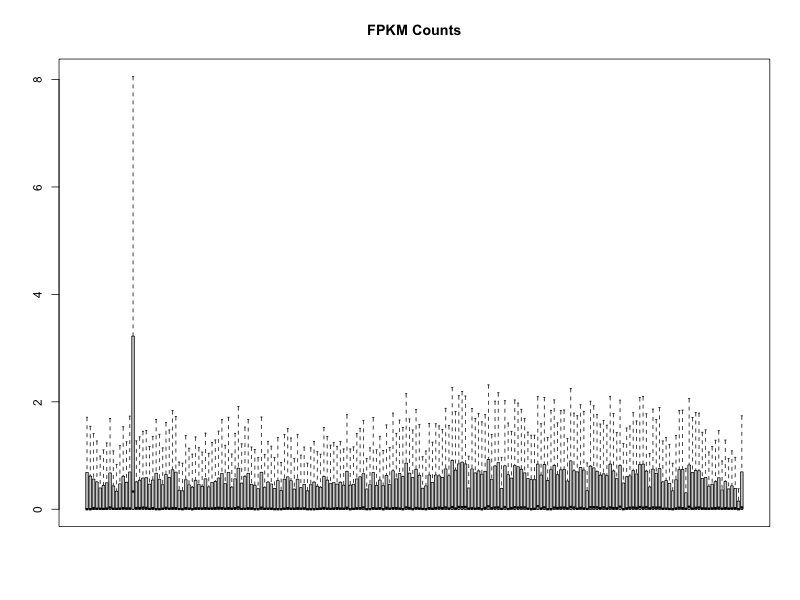
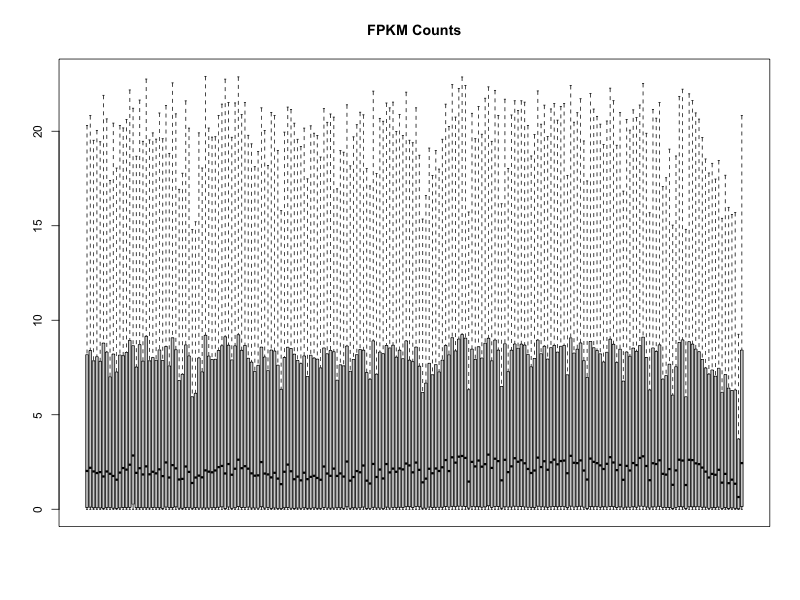
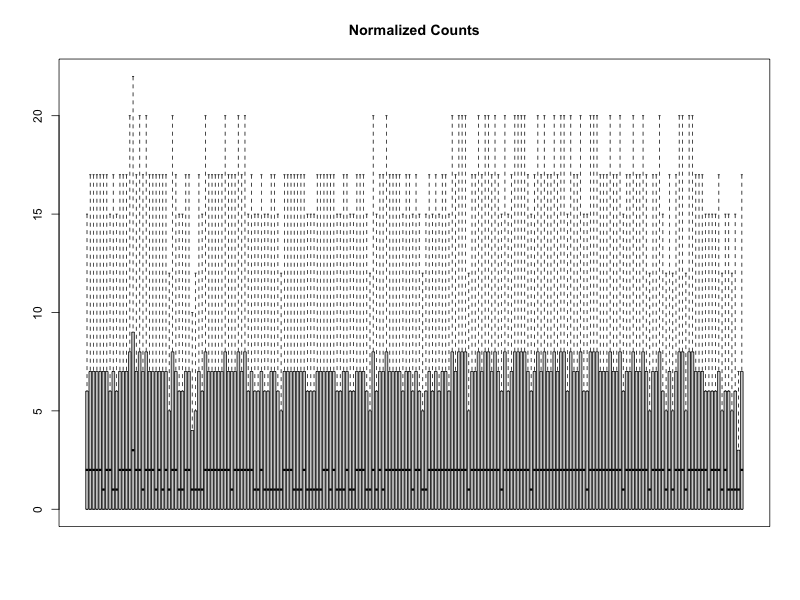
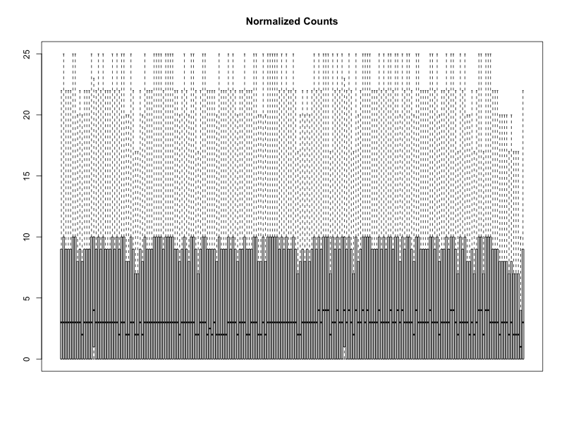

To execute the code blocks in this file, the following software installations are required: R and RStudio. To ensure that all necessary R packages are installed, the first code block of the raw RMarkdown file should be run, which is not displayed in the knitted HTML file. To ensure that all necessary dependencies and function definitions have been loaded, please ensure to execute the code blocks in the order that they appear in this document. To execute a block of code, the raw RMarkdown file should be opened in RStudio and the "Run Current Chunk" option may be used.

``` {r setup, include=FALSE}
## R set-up
installed_r_packages <- installed.packages()
# Check if BiocManager is installed
if (!"BiocManager" %in% installed_r_packages) {
  install.packages("BiocManager")
}
# Add needed packages to R environment (any that have not already been installed)
needed_r_packages <- c("knitr", "grDevices", "tidyverse", "DT", "rgl", "neuralnet", "e1071", "randomForest", "stringr", "caret")
bio_packages <- c("TCGAbiolinks", "SummarizedExperiment", "limma", "AnnotationDbi", "org.Hs.eg.db", "EDASeq")
for (package in needed_r_packages){
  if (!package %in% installed_r_packages){
    # Install using BiocManager if applicable, otherwise use CRAN
    if (package %in% bio_packages){
      BiocManager::install(package)
    } else{
      install.packages(package)
    }
  }
}

## Global code chunk options
library(knitr)
knitr::opts_chunk$set(echo = TRUE)
knitr::opts_chunk$set(message = FALSE)
knitr::opts_chunk$set(warning = FALSE)
knitr::opts_chunk$set(class.source = "fold-show")
knitr::opts_chunk$set(results = "show")
knitr::opts_chunk$set(cache = FALSE)
```

# Data Download

The below R code block queries the GDC API to retrieve RNA sequencing data (from the STAR pipeline) for the TCGA-BRCA project and sample data is extracted. The first 100 primary tumor samples and first 100 normal tissues samples are selected, and the GDC API is again queried. This final query is then input within the GDCdownload function to download RNA sequencing data for each of these 200 selected samples and save in the GDCdata directory. The downloaded data is then loaded into a SummarizedExperiment object.

```{r download, cache=TRUE}
library(TCGAbiolinks)

# Query GDC API for RNA seq data
project_samples <- suppressMessages(GDCquery(project = "TCGA-BRCA", 
                         data.category = "Transcriptome Profiling", 
                         data.type = "Gene Expression Quantification",
                         workflow.type = "STAR - Counts"))
# Extract sample information
sample_data <- getResults(project_samples)

# Select 100 primary tumor samples and 100 normal samples
tumor_cases <- TCGAquery_SampleTypes(barcode = sample_data$cases, typesample = "TP")[1:100]
normal_cases <- TCGAquery_SampleTypes(barcode = sample_data$cases, typesample = "NT")[1:100]
# Query for only selected samples #
TargetSamples <- suppressMessages(GDCquery(project = "TCGA-BRCA",
                             data.category = "Transcriptome Profiling",
                             data.type = "Gene Expression Quantification",
                             workflow.type = "STAR - Counts",
                             barcode = c(tumor_cases, normal_cases)))

# Download data for selected samples to GDCdata directory
GDCdownload(TargetSamples)

# Load into SummarizedExperiment object
exp_data <- GDCprepare(TargetSamples)
```

# Data Preparation

The below R code uses the TCGAanalyze_Preprocessing function to extract the expression data from the HTSeq – FPKM assay, which is normalized for transcript length and sequencing depth [1]. A boxplot is then constructed to visualize gene expression distributions across samples that have at least an average spearman correlation coefficient of 0.6 with other samples [2]. To avoid any potential issues rending the large boxplot, it is first saved to a png file then displayed below.

```{r}
library(TCGAbiolinks)
library(grDevices)

extract_counts <- function(exp_obj){
  # Extract expression data for fpkm_unstrand assay
  expr_data <- TCGAanalyze_Preprocessing(object = exp_obj, cor.cut = 0.6,  datatype = "fpkm_unstrand")
  return(expr_data)
}

expr_boxplot <- function(expr_data, file_path, norm=F){
  # Plot gene expression spread by sample without outliers and write to png file
  png(file_path, width = 800, height = 600)
  boxplot(expr_data, outline = FALSE, xaxt="n", main=ifelse(norm, "Normalized Counts", "FPKM Counts"))
  dev.off()
}

# Visualize gene expression speads for all genes
expr_data <- extract_counts(exp_data)
expr_boxplot(expr_data, "fpkm_counts_all.png")
```



The below R code filters the SummarizedExperiment object for only gene expression results from protein-coding genes. This was performed as a first step to reduce the number of features, as many protein-coding genes are typically less noisy and would be more easily interpreted for a tumor vs normal classification model. In the same manner as performed for all gene expression results, the HTSeq – FPKM assay results are extracted and visualized below. It is clear from both box plots that quantile variation is present across these fairly correlated samples, and there is 1 sample where the variation in gene expression across all genes is much greater than that of other samples.

```{r}
library(SummarizedExperiment)

# Visualize gene expression spreads for protein-coding genes
exp_data_coding <- exp_data[rowData(exp_data)$gene_type == "protein_coding", ]
expr_data_coding <- extract_counts(exp_data_coding)
expr_boxplot(expr_data_coding, "fpkm_counts_coding.png")
```



The below R code uses the TCGAanalyze_Normalization function to further adjust expression data (all genes) for potential batch effects using multiple normalization techniques [2]. The boxplot of the adjusted expression data shows more quantile uniformity between samples. However, with the data at hand there is not enough information to determine if the reason that 1 sample showed much greater spread in gene expression prior to this adjustment was due to a technical reason or a biological reason. No matter which was the case, this sample appears to me much different than the other samples and likely not the best to include in a model. For this reason, only protein-coding genes were included in the rest of the analysis.

```{r}
library(EDASeq)

normalize_data <- function(expr_data){
  # Perform normalization
  expr_data_norm <- TCGAanalyze_Normalization(tabDF = expr_data, geneInfo = geneInfoHT, method = "geneLength")
  return(expr_data_norm)
}

# Normalize and re-plot for all genes
expr_data_norm <- normalize_data(expr_data)
expr_boxplot(expr_data_norm, "norm_counts_all.png", norm=T)
```



The below R code uses the TCGAanalyze_Normalization function to further adjust expression data (protein-coding genes) for potential batch effects using multiple normalization techniques [2]. The boxplot of the adjusted expression data shows more quantile uniformity between samples. This normalized and batch effect adjusted expression data for protein-coding genes was used in all of the below analyses.

```{r}
# Normalize and re-plot for protein-coding genes
expr_data_norm_coding <- normalize_data(expr_data_coding)
expr_boxplot(expr_data_norm_coding, "norm_counts_coding.png", norm=T)
```



# Data Exploration

The below R code extracts the sample (patient) data from the SummarizedExperiment object and reorders it to be in the same order as the samples are ordered in the expression data. The calculate_correlation function is defined and used to calculate the spearman correlation coefficient between the expression of each gene and patient age, as well as between the expression of each gene and days to death. The significance of each correlation was assessed and the p-value was adjusted for multiple testing. The filter_corr_results function is then used to filter correlation results for only those with a correlation coefficient above an input threshold.

As shown by the below printed results, there are no genes that are correlated with patient age with a coefficient of at least 0.6, and there is just 1 gene that is moderately correlated with days to death. These results help provide some confidence that there is a low chance of confounding variables in the dataset, and the gene expression levels alone should be able to be assessed for a relationship with outcome (tumor vs normal) without worrying about influence from other factors.

```{r corr}
calculate_correlation <- function(expr, var){
  # Calculate correlation coefficient between each expression of each gene and var
  cors <- suppressWarnings(apply(expr, 1, function(gene) cor(gene, var, use = "pairwise.complete.obs", method = "spearman")))

  # Compute p-values for each correlation
  pvals <- suppressWarnings(apply(expr, 1, function(gene) cor.test(gene, var, method = "spearman")$p.value))
  
  # Combine into a data frame
  results <- data.frame(
    gene = rownames(expr),
    correlation = cors,
    p_value = pvals
  )
  
  # Adjust for multiple testing
  results$FDR <- p.adjust(results$p_value, method = "BH")
  return(results)
}

filter_corr_results <- function(df, corr_threshold){
  df[abs(df$correlation) >= corr_threshold, ]
}

# Extract patient data
patient_data <- as.data.frame(colData(exp_data_coding))
# Place in same order of samples in expr data
patient_data <- patient_data[colnames(expr_data_norm_coding), , drop = FALSE]

# Compute correlations with age_at_index
corr_age <- calculate_correlation(expr_data_norm_coding, patient_data$age_at_index)
corr_age_sig <- filter_corr_results(corr_age, 0.8)
print(nrow(corr_age_sig))
corr_age_sig_2 <- filter_corr_results(corr_age, 0.6)
print(nrow(corr_age_sig_2))

# Compute correlations with days_to_death
corr_death <- calculate_correlation(expr_data_norm_coding, patient_data$days_to_death)
corr_death_sig <- filter_corr_results(corr_death, 0.8)
print(nrow(corr_death_sig))
corr_death_sig_2 <- filter_corr_results(corr_death, 0.6)
print(nrow(corr_death_sig_2))
```

The below R code uses the calculate_correlation_multi function to calculate pairwise correlation coefficients and their significance between all features in the patient data. This is done by selecting only numeric columns with at least 3 finite observations, then computing the correlation coefficient and p-value. All correlation coefficients between a feature and itself are converted to 0, and the absolute value is taken of all remaining correlation coefficients. The results are then filtered based on an input threshold, which in this case is 0.7, and duplicate pairs are removed. These results are displayed below using the display_table function.

The pairs of patient data features that are correlated with a correlation coefficient (absolute value) of at least 0.7 cannot likely be attributed to gene expression differences. For example, the different age variables (i.e. age at diagnosis, age at index) will of course be correlated when the measurements are taken from the same set of patients. The fact that no relevant correlations between patient data features have been found provides confidence that the gene expression levels alone should be able to be assessed for a relationship with outcome (tumor vs normal) without worrying about influence from other factors.

```{r corr_2}
library(DT)

calculate_correlation_multi <- function(mat, threshold, pval_threshold){
  # Keep only numeric columns
  mat_num <- mat[sapply(mat, is.numeric)]
  
  # Keep only columns with at least 3 finite observations
  keep_cols <- apply(mat_num, 2, function(x) sum(is.finite(x)) >= 3)
  mat_num <- mat_num[, keep_cols, drop = FALSE]
  
  # Correlation matrix
  corr_mat <- suppressWarnings(cor(mat_num, use = "pairwise.complete.obs", method = "spearman"))
  
  # P-value matrix
  p_mat <- matrix(NA, ncol = ncol(mat_num), nrow = ncol(mat_num))
  colnames(p_mat) <- rownames(p_mat) <- colnames(mat_num)

  for (i in seq_len(ncol(mat_num) - 1)) {
    for (j in (i + 1):ncol(mat_num)) {
      test <- suppressWarnings(
        cor.test(mat_num[[i]], mat_num[[j]],
                 use = "pairwise.complete.obs",
                 method = "spearman")
      )
      p_mat[i, j] <- p_mat[j, i] <- test$p.value
    }
  }
  
  # Absolute correlations
  abs_corr <- abs(corr_mat)
  # Remove self-correlations
  diag(abs_corr) <- 0
  # Threshold
  high_corr <- which(abs_corr > threshold & p_mat < pval_threshold, arr.ind = TRUE)
  
  # Convert to readable table
  corr_pairs <- data.frame(
    feature1 = rownames(abs_corr)[high_corr[,1]],
    feature2 = colnames(abs_corr)[high_corr[,2]],
    correlation = corr_mat[high_corr],
    p_value = p_mat[high_corr]
  )
  
  # Remove duplicate pairs
  corr_pairs <- corr_pairs[corr_pairs$feature1 < corr_pairs$feature2, ]
  
  return(corr_pairs)
}

display_table <- function(table){
  datatable(
  table,
  options = list(
    scrollX = TRUE
  )
)
}

# Calculate correlation coefficients
patient_data_corrs <- calculate_correlation_multi(patient_data, 0.7, 0.05)
display_table(patient_data_corrs)
```

The below R code block sorts the gene expression data in order of decreasing variance and filters out genes with very low variance across all tissue samples, as these mainly indicate genes that are not expressed at all in most of the samples. Exploring variance in the data is important for model building to ensure that most relevant predictors are included.

The top 10 genes with greatest variance in expression and the 10 genes with the least variance in expression are displayed below. Interestingly, the ENSG00000143632 gene shows pretty low expression across most samples except for 1 sample, where expression is > 27,000. Perhaps this gene is not the best to include in a diagnostic model that can be generalized to other patients, but would be worth diving into further in a different analysis to understand why the gene is showing much higher expression in just a single patient.

```{r corr_3}
# Function to compute variances and sort by descending variance
compute_variance_df <- function(df, threshold){
  df <- as.data.frame(df)

  df$Variance <- apply(df, 1, var)
  df <- df[order(df$Variance, decreasing = T),]
  # Filter out records with little Variance and Remove Variance column
  df <- df %>%
    dplyr::filter(Variance > threshold) %>%
    dplyr::select(-Variance)

  return(df)
}

expr_data_sorted <- compute_variance_df(expr_data_norm_coding, 2)
# Top 10 greatest variance
display_table(head(expr_data_sorted, 10))
# Top 10 lowest variance
display_table(tail(expr_data_sorted, 10))
```

The below R code block uses the pca_analysis function to perform principal component analysis (PCA) on the genes with top 1000 highest variance. For each of these analyses, the plot_pca function is used to visualize the first 3 PCs colored by a particular categorical feature of the patient data.

The PCA results show that the first 10 PCs only explain about 56% of the total variation in the data. However, plotting the first 3 PCs, which capture about 36% of total variation in the data, shows distinct separation when coloring by tissue type. Coloring by prior malignancy status does not appear to show any distinct separation, although the "no" status appears to be overrepresented in this dataset. Coloring by metastasis status at diagnosis does not appear to show any distinct separation, although the "no" status appears to be overrepresented in this dataset, along with many missing observations. Coloring by race does not appear to show any distinct separation, although the white race appears to be overrepresented in this dataset.

PCA analysis is important to perform on high-dimensional datasets such as gene expression data prior to model building for several reasons such as exploring any potential clustering. For this particular example, the PCA plots have demonstrated that their are indeed genes in the data that can separate patients into a normal or treatment group, and it is unlikely that prior malignancy status, metastasis statues, or race is providing an influence on expression of the most highly variable genes that is large enough to be considered critical for a diagnostic model. These findings demonstrate that tissue type classification could be feasible with a high degree of accuracy.

```{r pca}
options(rgl.useNULL=TRUE)
library(rgl)
library(SummarizedExperiment)

# Define PCA function
pca_analysis <- function(df, num_genes){
  # Select genes with top variance
  top_data <- df[1:num_genes, ]
  # Transpose to place variables (genes) as columns
  top_data_t <- t(top_data)
  # Perform PCA
  pca<-prcomp(top_data_t,retx=TRUE,scale=TRUE)
  # Display percent of variance explained by each PC
  pca_summary <- summary(pca)$importance[, 1:10]
  print(pca_summary)

  return(pca)
}

# Define plot function
plot_pca <- function(pca, strat_data, num_genes){
  # Convert to numeric vector for coloring
  numeric_vector <- as.numeric(factor(strat_data))
  # Generate 3D pot
  plot3d(pca$x[,1:3], col=numeric_vector, type = "s", main=paste0("PC Projection by for ", num_genes, " Genes"))
  # Add legend
  legend3d("topright",
         legend = unique(strat_data),
         col    = unique(numeric_vector),
         pch    = 16,
         cex    = 0.8)
  # Show plot
  rglwidget()
}

# PCA analysis for genes with top 1000 variance
pca_top_1000 <- pca_analysis(expr_data_sorted, 1000)
# Plot first 3 PCs and color by categorical variable
plot_pca(pca_top_1000, patient_data$tissue_type, 1000)
plot_pca(pca_top_1000, patient_data$prior_malignancy, 1000)
plot_pca(pca_top_1000, patient_data$metastasis_at_diagnosis, 1000)
plot_pca(pca_top_1000, patient_data$race, 1000)
```

# Model Development and Testing

The below R code defines several functions that are used in the subsequent code block, and each is described in the description of the subsequent code block.

```{r cross-validate-functions}
library(neuralnet)
library(e1071)
library(randomForest)
library(limma)
library(stringr)

# Function to append to data frame
df_append <- function(df, new_row){
  if (is.null(df)){
    df <- new_row
  } else{
    df <- rbind(df, new_row)
  }
  return(df)
}

# Function to split predictors and outcomes into training and test sets
split_data <- function(pred_data, outcomes_df, test_idx){
  # Extract training and test predictor data
  pred_data_test <- pred_data[, test_idx, drop = F]
  train_idx <- setdiff(1:ncol(pred_data), test_idx)
  pred_data_train <- pred_data[, train_idx, drop = F]
  # Extract training and test outcomes
  outcomes_train <- outcomes_df[train_idx, ]
  outcomes_test <- outcomes_df[test_idx, ]

  return(list(
    pred_data_train = pred_data_train,
    pred_data_test = pred_data_test,
    outcomes_train = outcomes_train,
    outcomes_test = outcomes_test
  ))
}

# Function to perform differential gene expression analysis
diff_expr_analysis <- function(expr_data, patient_data){
  # Extract tumor and normal sample IDs
  tumor_samples <- patient_data %>% dplyr::filter(tissue_type == "Tumor")
  tumor_sample_ids <- row.names(tumor_samples)
  normal_samples <- patient_data %>% dplyr::filter(tissue_type == "Normal")
  normal_sample_ids <- row.names(normal_samples)
  
  diff_expr_results <- TCGAanalyze_DEA(mat1 = expr_data[,normal_sample_ids],
                              mat2 = expr_data[,tumor_sample_ids],
                              pipeline="limma",
                              Cond1type = "Normal",
                              Cond2type = "Tumor",
                              fdr.cut = 0.01 ,
                              logFC.cut = 1,
                              method = "glmLRT", ClinicalDF = data.frame()
                              )
  # Extract differentially expressed genes (already sorted in order of ascending p-value)
  diff_genes <- diff_expr_results$t
  names(diff_genes) <- row.names(diff_expr_results)
  return(diff_genes)
}

# Function to select features that are not correlated with each other
forward_selection <- function(expr_data, feature_choices, outcomes, k = 10, redundancy_weight = 0.5) {
  # Format predictors and outcomes
  formatted_vars <- format_vars(expr_data, outcomes)
  # Subset for only features under consideration
  expr_data <- formatted_vars$expr_data_binary[,names(feature_choices)]
  features <- names(expr_data)
  
  # Store selected features
  selected <- character(0)

  for (step in seq_len(k)) {
    # Features not already selected
    candidates <- setdiff(features, selected)
    
     if (length(selected) == 0){
       # Randomly select 1 of top 5 most relevant features
       best_feature <- sample(features[1:5], 1)
     } else{
       # Compute relevancy scores
      scores <- sapply(candidates, function(f) {
        # Set relevance equal to t-statistic between conditions
        relevance <- abs(feature_choices[f])
  
        # Compute redundancy (mean correlation with features already selected)
        redundancy <- mean(
            abs(cor(expr_data[[f]], expr_data[selected],
                    method = "spearman"))
          )
  
        # Apply redundancy penalty
        relevance - redundancy_weight * redundancy
      })
  
      # Select feature with maximum relevancy score
      best_feature <- candidates[which.max(scores)]
     }
    
    # Add selected feature
    selected <- c(selected, best_feature)
  }

  return(selected)
}

# Function to format predictor and outcome data to be compatible with various model types
format_vars <- function(expr_data, outcomes){
  # Convert to correct orientation and data type
  expr_df_t <- as.data.frame(t(expr_data))
  # Convert outcomes to correct format and add to data frame
  outcomes_binary <- as.numeric(outcomes == "Tumor")
  outcomes_factor = as.factor(outcomes_binary)
  
  # Bind outcomes to predictors
  expr_df_binary <- cbind(expr_df_t, outcomes_binary)
  expr_df_factor <- cbind(expr_df_t, outcomes_factor)
  
  return(list(
    expr_data_binary = expr_df_binary,
    expr_data_factor = expr_df_factor,
    outcomes_binary = outcomes_binary,
    outcomes_factor = as.factor(outcomes_binary)
  ))
}

# Function to optimize parameter for SVM
optimize_svn_param <- function(f, data, param_range, kernel=NULL){
  tune(
    METHOD = "svm",
    train.x = f,
    data = data,
    kernel = kernel,
    ranges = param_range,
    tunecontrol = tune.control(cross = 5)
  )
}

# Function to expand formula for functions that do not accept shortcut
expand.formula = function(f,data=NULL) {
  f.str = deparse(f)
  
  if ( !grepl("\\.$",f.str)[1] ) {
    return(f)
  }

  dependent.name = sub("\\s*~.*","",f.str)

  predictors = names(data)[ names(data) != dependent.name ]

  predictor_str = paste(predictors,collapse=" + ")

  f.str.expanded = sub("\\.$",predictor_str,f.str)

  f = tryCatch(
    expr = as.formula(f.str.expanded,env=environment(f)),
    error = function(e){
      stop("Too many predictors")
    }
  )
    
  return(f)
}

# Function to calculate and round percentage
calculate_pct <- function(num, denom){
  pct <- (num / denom) * 100
  return(signif(pct, 3))
}

# Function to evaluate performance of model
assess_model <- function(model, new_data, actual_values, param_name=NA, param_value=NA){
  if (!is.null(model)){
    # Prediction
    pred_values <- predict(model, newdata=new_data, type="response")
    # Format
    if (class(pred_values)[1] == "matrix") pred_values <- pred_values[,1]
    if (!is.factor(pred_values)){
      pred_values_bin <- as.numeric(pred_values > 0.5)
    } else{
      pred_values_bin <- pred_values
    }
    
    # Calculate accuracy
    num_correct <- sum(actual_values==pred_values_bin)
    accuracy <- calculate_pct(num_correct, length(pred_values_bin))
    # Calculate counts
    TP = sum(actual_values==1 & pred_values_bin==1)
    TN = sum(actual_values==0 & pred_values_bin==0)
    FP = sum(actual_values==0 & pred_values_bin==1)
    FN = sum(actual_values==1 & pred_values_bin==0)
    P = TP+FN # total number of positives in the truth data
    N = FP+TN # total number of negatives
    # Calculate metrics
    TPR <- calculate_pct(TP, P)
    TNR <- calculate_pct(TN, N)
    PPV <- calculate_pct(TP, TP+FP)
    FDR <- 100 - PPV
    FPR <- calculate_pct(FP, N)
  
    # Extract predictors
    predictors <- names(new_data)[grep("outcomes", names(new_data), invert = TRUE)]
    predictors_str <- paste(predictors, collapse=",")
    
    return(list(
      model_type = class(model)[1],
      num_predictors = length(predictors),
      predictors = predictors_str,
      param_name = param_name,
      param_value = param_value,
      accuracy = accuracy,
      TPR = TPR,
      TNR = TNR,
      PPV = PPV,
      FDR = FDR,
      FPR = FPR
    ))
  }
  return(NULL)
}

# Function to train several model types
train_models <- function(outcomes, expr_data, new_data, actual_values){
  ## Format predictors and outcomes
  formatted_vars_train <- format_vars(expr_data, outcomes)
  formatted_vars_test <- format_vars(new_data, actual_values)
  
  ## Compile formulas
  
  # Factor formula
  outcomes_factor <- formatted_vars_train$outcomes_factor
  f <- outcomes_factor ~ .
  # Expand binary formula
  outcomes_binary <- formatted_vars_train$outcomes_binary
  f_binary <- expand.formula(f_binary <- outcomes_binary ~ ., formatted_vars_train$expr_data_binary)
  
  ## Ensure reproducibility for parameter optimization
  set.seed(123)

  ## Logistic regression
  glm_model <- tryCatch(
    expr = {
      glm(f_binary, data = formatted_vars_train$expr_data_binary, family = "binomial",
               control = glm.control(maxit = 100))
    },
    warning = function(w){
      print(paste0(w$message, ". Skipping logistic regression model for ", ncol(formatted_vars_train$expr_data_binary), " features"))
      return(NULL)
    }
  )
  glm_eval <- assess_model(glm_model, formatted_vars_test$expr_data_binary, formatted_vars_test$outcomes_binary)
  
  ## Linear SVM
  # Optimize C
  C_vals <- 10^seq(-3, 3, by = 1)
  svm_linear_tuned <- optimize_svn_param(f, formatted_vars_train$expr_data_factor, list(cost = C_vals), kernel = "linear")
  
  # Fit and evaluate model with optimized C
  svm_linear=svm(f,formatted_vars_train$expr_data_factor,kernel="linear",cost=svm_linear_tuned$best.parameters$cost)
  svm_linear_eval <- assess_model(svm_linear, formatted_vars_test$expr_data_factor, formatted_vars_test$outcomes_factor, param_name="cost", param_value=svm_linear_tuned$best.parameters$cost)
  
  ## Polynomial SVM
  
  # Optimize degree
  degree_grid <- c(2, 3, 4, 5)
  svm_poly_tuned <- optimize_svn_param(f, formatted_vars_train$expr_data_factor, list(degree = degree_grid), kernel = "polynomial")
  
  # Fit and evaluate model with optimized degree
  svm_poly=svm(f,formatted_vars_train$expr_data_factor,kernel="polynomial",degree=svm_poly_tuned$best.parameters$degree)
  svm_poly_eval <- assess_model(svm_poly, formatted_vars_test$expr_data_factor, formatted_vars_test$outcomes_factor, param_name="degree", param_value=svm_poly_tuned$best.parameters$degree)
  
  ## Radial SVM
  
  # Optimize gamma
  gamma_grid <- 10^seq(-4, 1, by = 1)
  svm_rad_tuned <- optimize_svn_param(f, formatted_vars_train$expr_data_factor, list(gamma = gamma_grid), kernel = "radial")
  # Fit and evaluate model with optimized gamma
  svm_rad=svm(f,formatted_vars_train$expr_data_factor,kernel="radial", gamma = svm_rad_tuned$best.parameters$gamma)
  svm_rad_eval <- assess_model(svm_rad, formatted_vars_test$expr_data_factor, formatted_vars_test$outcomes_factor, param_name="gamma", param_value=svm_rad_tuned$best.parameters$gamma)
  
  ## Random forest
  
  # Optimize mtry
  mtry_vals <- seq(1, floor(sqrt(ncol(formatted_vars_train$expr_data_factor)) * 2))

  oob_err <- sapply(mtry_vals, function(m) {
    rf <- randomForest(
      x = formatted_vars_train$expr_data_factor,
      y = formatted_vars_train$outcomes_factor,
      mtry = m,
      ntree = 500
    )
    rf$err.rate[500, "OOB"]
  })
  
  best_mtry <- mtry_vals[which.min(oob_err)]
  
  # Fit and evaluate model with optimized mtry
  rf_model=randomForest(f,formatted_vars_train$expr_data_factor, mtry=best_mtry,importance=TRUE)
  rf_eval <- assess_model(rf_model, formatted_vars_test$expr_data_factor, formatted_vars_test$outcomes_factor, param_name="mtry", param_value=best_mtry)
  
  ## Neural network - no hidden layer
  
  # Train and evaluate model
  nn_model <- neuralnet(f_binary, formatted_vars_train$expr_data_binary, hidden = 0, linear.output = F)
  nn_eval <- assess_model(nn_model, formatted_vars_test$expr_data_binary, formatted_vars_test$outcomes_binary,param_name="hidden", param_value=0)
  
  ## Neural network - hidden layer (1/2 # of predictors rounded up as # of neurons)
  hidden_neurons <- ceiling((length(names(formatted_vars_train$expr_data_binary)) - 1) / 2)
  nn_model_h <- neuralnet(f_binary, formatted_vars_train$expr_data_binary, hidden = hidden_neurons, linear.output = F)
  nn_eval_h <- assess_model(nn_model_h, formatted_vars_test$expr_data_binary, formatted_vars_test$outcomes_binary, param_name="hidden", param_value=hidden_neurons)
  
  # Generate data frame
  model_info <- list(
    glm_eval, svm_linear_eval, svm_poly_eval, svm_rad_eval, rf_eval, nn_eval,nn_eval_h
  )
  model_info_df <- as.data.frame(do.call(rbind, lapply(model_info, unlist)))
  
  return(model_info_df)
}
```

The below R code uses the createFolds function from the caret package to partition the data into 5 folds, and a for loop iterates across the folds. At each iteration, the split_data function is used to split the gene expression data and patient data into a training set (composed of 80% of the observations) and a test set. Differential gene expression analysis is performed using the diff_expr_analysis function to select only the genes that are differentially expressed between normal and tumor conditions in the training data with a log fold change of at least 1 and a multiple testing-adjusted significance of 0.01 or less. To further refine the list of genes to use as predictors in model training, the forward_selection function is used to select the top 10 genes that were most differentially expressed between disease states but least correlated with each other. Because the features that can be selected with a forward selection strategy are dependent on the features that have already been selected, the first gene selected is randomly chosen from the genes with top 5 t-statisic between tumor and normal conditions.

The train_models function is then used to train and evaluate several different model types using 1, 5, and 10 selected genes. During each round of training, the format_vars function is used to format the predictor genes dataset and outcomes into data types and orientations that are compatible with the R functions which train models. The model types trained are logistic regression, support vector machine (SVM) linear, SVM polynomial, SVM radial, random forest, and neural network (NN). Parameters for each of the SVM models are optimized using the optimize_svn_param function. For linear SVM, the cost (C) parameter, which controls the weight of the penalty on misclassifications, is tuned. For polynomial SVM, the degree parameter, which controls the degree of the function mapping the data into a higher dimensional space, is tuned. For radial SVM, the gamma parameter, which controls the influence of a single data point, is tuned. The mtry parameter of the random forest model, which controls the number of predictor variables selected at each split of the tree, is also tuned by selecting the value which minimizes out-of-bag (OOB) error [3]. A NN model was fitted both with and without a hidden layer.

Each of the trained models is evaluated using the assess_model function. The calculated performance metrics are accuracy, true positive rate (TPR), true negative rate (TNR), positive predictive value (PPV), false discovery rate (FDR), and false positive rate (FPR). For logistic regression, predicted values above 0.5 are considered classified as tumor tissue. The evaluation results for each of the model types for the different number of predictor genes for all iterations is displayed below.

```{r cross_validate}
library(caret)

# Generate 5 folds
set.seed(123)
splits <- createFolds(
  y = patient_data$tissue_type,
  k = 5
)

model_evals <- NULL

# Loop through splits
for (split in seq_along(splits)){
  ## Split data into training and test sets
  data_split <- split_data(expr_data_sorted, patient_data, splits[[split]])
  
  ##  Perform feature selection
  
  # Diff gene expression analysis
  diff_genes <- diff_expr_analysis(data_split$pred_data_train, data_split$outcomes_train)
  # Use forward selection for feature selection
  selected_features <- forward_selection(data_split$pred_data_train, diff_genes, data_split$outcomes_train$tissue_type)
  
  ## Train and evaluate models
  models_single <- train_models(
    data_split$outcomes_train$tissue_type, 
    data_split$pred_data_train[selected_features[1],],
    data_split$pred_data_test[selected_features[1],],
    data_split$outcomes_test$tissue_type
  )
  models_5 <- train_models(
    data_split$outcomes_train$tissue_type, 
    data_split$pred_data_train[selected_features[1:5],],
    data_split$pred_data_test[selected_features[1:5],],
    data_split$outcomes_test$tissue_type
  )
  models_all <- train_models(
    data_split$outcomes_train$tissue_type, 
    data_split$pred_data_train[selected_features,],
    data_split$pred_data_test[selected_features,],
    data_split$outcomes_test$tissue_type
  )
  
  ## Add evaluation to df
  model_evals <- df_append(model_evals, models_single)
  model_evals <- df_append(model_evals, models_5)
  model_evals <- df_append(model_evals, models_all)
}

display_table(model_evals)
```

The below R code block uses the generate_model_summary function to obtain the mean for each of the performance metrics for each model type, and the results are displayed below. These results show very high mean accuracy rates of over 95% for all model types except for the NN without a hidden layer and the SVM polynomial model. Mean TPR and mean TNR was also very high for most of the model types, but significantly lower for the NN without a hidden layer. The mean FDR and mean FPR were also significantly higher for this model compared to the other types. Based on these results, the models which achieve the best balance between TPR and FPR are logistic regression, random forest, SVM linear, and SVM radial.

```{r analyze_results}
# Function to group df and calculate mean
generate_model_summary <- function(df, group_cols, metric_cols){
 df %>%
    mutate(
      model_type = case_when(
        model_type == "svm.formula" ~ paste(model_type, param_name, sep="."),
        model_type == "nn" & param_value >0 ~ "nn_hidden",
        .default = model_type
      ) 
    ) %>%
    group_by(across(all_of(group_cols))) %>%
    summarise(
      across(
        all_of(metric_cols),
        list(
          mean = ~ mean(as.numeric(.x), na.rm = TRUE)
        ),
        .names = "{.col}_{.fn}"
      ),
      .groups = "drop"
    )
}

# Define metric columns to summarize
metric_cols <- c("accuracy",
      "TPR",
      "TNR",
      "PPV",
      "FDR",
      "FPR")

# Analyze by model type
summary_by_model <- generate_model_summary(model_evals, "model_type", metric_cols)
display_table(summary_by_model)
```

The below R code analyzes the results more deeply by grouping by both model type and number of predictor genes, and the results are displayed below. For the logistic regression model, adding 4 additional predictor genes resulted in improvements across all metrics, including reducing the FDR and FPR to 0. For the NN model without a hidden layer, accuracy decreased and FPR rate increased as more predictor genes were added. For the NN model with a hidden layer, performance stayed fairly consistent. For the random forest model, the best performance was seen with 5 and 10 predictor genes. For the SVM linear model, the best performance was seen with 10 predictor genes. For the SVM polynomial model, the best performance was seen with 5 or 10 predictor genes. For the SVM radial model, the best performance was seen with 10 predictor genes.

```{r analyze_results_2}
# By model type and feature count
summary_by_fc <- generate_model_summary(model_evals, c("model_type", "num_predictors"), metric_cols)
display_table(summary_by_fc)
```

To select the best model type to use, it will depend on what needs to be prioritized the most. However, the logistic regression, random forest, and SVM models all showed a nice balance between sensitivity and specificity. Both of these factors are very important in this situation to ensure patient safety is prioritized while also minimizing causing unnecessary worry. The current results indicate that selecting 5 or 10 genes using the described feature selection strategy produces very good performance, and having the prediction not be based on just a single gene can provide flexibility in case of any technical issues or overfitting. However, these recommendations are from only a single analysis. To ensure that the models recognize trends that are more widespread and not unique to just a few samples, it is important that the steps described in this project are repeated with the inclusion of more samples and more rounds of cross validation.

The below R code extracts all of the genes that were used in at least one cross-validation round as a predictor and merges with gene name annotations for further study.

```{r genes}
library(AnnotationDbi)
library(org.Hs.eg.db)

# Extract predictors used at all iterations
predictors <- unlist(strsplit(unique(model_evals$predictors), ","))
predictors_unique <- unique(predictors)

# Merge gene name annotations
gene_annot <- select(
  org.Hs.eg.db,
  keys = predictors_unique,
  keytype = "ENSEMBL",
  columns = c("SYMBOL", "GENENAME")
)
display_table(gene_annot)
```

# Works Cited

1. Zhao Y, Li MC, Konaté MM, Chen L, Das B, Karlovich C, Williams PM, Evrard YA, Doroshow JH, McShane LM. TPM, FPKM, or Normalized Counts? A Comparative Study of Quantification Measures for the Analysis of RNA-seq Data from the NCI Patient-Derived Models Repository. J Transl Med. 2021 Jun 22;19(1):269.

2. Colaprico A, Silva TC, Olsen C, Garofano L, Cava C, Garolini D, Sabedot TS, Malta TM, Pagnotta SM, Castiglioni I, Ceccarelli M, Bontempi G, Noushmehr H. TCGAbiolinks: an R/Bioconductor package for integrative analysis of TCGA data. Nucleic Acids Res. 2016 May 5;44(8):e71.

3. Probst P, Wright MN, Boulesteix A-L. Hyperparameters and tuning strategies for random forest. WIREs Data Mining Knowl Discov. 2019; 9:e1301.


  